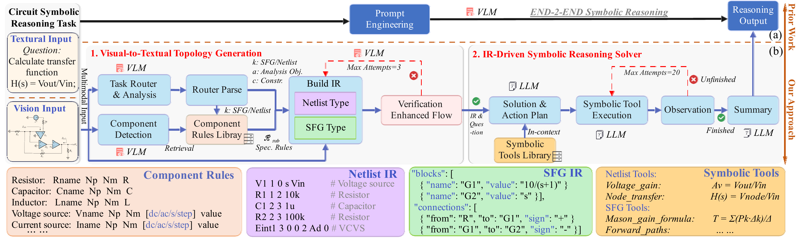

# AutoVSR

<p align="center">
  
</p>

<p align="center">
  <strong>From circuit schematics to executable IR, symbolic tool planning, and final analytical expressions.</strong>
</p>

AutoVSR is a multi-agent visual-symbolic reasoning framework for automatic
transfer-function and transient-response analysis from circuit schematics and
block diagrams.

The system routes each problem to either a netlist-based circuit solver or a
signal-flow-graph solver, validates intermediate representations, and uses
symbolic tools to derive the final expression.

## News

- **May 2026**: Our paper **AutoVSR: Automatic Visual-to-Symbolic Reasoning
for Symbolic Expression Generation from Circuit Schematic** has been accepted
to **ICML 2026**. For the full method, experiments, and analysis, please see
[our paper](https://icml.cc/virtual/2026/poster/66479).

## Features

- Dual-path reasoning for circuit schematics and block diagrams.
- Validated intermediate representations for netlists and SFGs.
- Reflection and retry on invalid intermediate representations.
- Symbolic solving with Lcapy, SymPy, and Mason's gain formula.
- Lightweight public tests in `examples/`.

## Paper Overview

<p align="center">
  
</p>

AutoVSR separates visual-to-symbolic reconstruction from symbolic derivation.
The framework first routes the input to the appropriate IR space, retrieves
component rules, builds either Netlist IR or SFG IR, and validates the result
with verification-based feedback. The validated IR is then passed to a
tool-augmented symbolic solver, where the agent plans the derivation while
deterministic tools execute transfer-function, response, and Mason-gain
computations.

## Installation

```bash
git clone https://github.com/kname1/AutoVSR.git
cd AutoVSR
python -m venv .venv
source .venv/bin/activate
pip install -r requirements.txt
```

Python 3.10+ is recommended.

## Configuration

The repository includes public-safe configuration files:

- `config/config.yaml` for the AutoVSR pipeline.

For the default GLM setup, set:

```bash
Simply modify the corresponding `api_key` in `config.yaml`.
```

The default `config/config.yaml` uses:

```yaml
llm:
  provider: "glm"
  model: "glm-4.6v-flashx"
```

The public examples include provided netlists for the three circuit cases, so
the test is reproducible. Set `ir.netlist.use_provided_netlist: false` if you
want to force visual netlist extraction from circuit images.

## Data

AutoVSR is benchmarked on the analysis portion of CircuitSense; the full
dataset is available on Hugging Face. Downloaded [here](https://huggingface.co/datasets/armanakbari4/CircuitSense).

The public test is `examples/test.json`, a small test set with three
lightweight circuit cases:

- 3 transfer-function cases covering `type1` through `type3`.
- Corresponding images under `examples/images/`.

## Run

Run the public test:

```bash
python main.py \
  -t batch \
  --data examples/test.json \
  --output test_result.json \
  --log test_result.log \
  --max-samples 3 \
  --no-resume
```

The output JSON and log are written under `output/`, which is ignored by Git.

### Example

One public test case is `synthetic_level1_q465`, a type2 transfer-function
problem:

```json
{
  "id": "synthetic_level1_q465",
  "question": "What is the transfer function from V1 to C1 in this circuit?",
  "expected_answer": "((1/(C1*R1))/(s + 1/(C1*R1)))*1",
  "predicted_answer": "H(s) = 1/(C1*R1*s + 1)",
  "ir_type": "netlist"
}
```

With `ir.netlist.use_provided_netlist: false`, AutoVSR extracts the netlist from
the image:

```text
R1 3 2 R1
C1 3 0 C1
V1 2 0 s V1
```

The solver detects that the question asks for the transfer function from source
`V1` to element `C1`, so it calls:

```text
element_transfer({"output_element": "C1", "input_source": "V1"})
```

The tool returns `H(s) = 1/(C1*R1*s + 1)`. This is symbolically equivalent to
the ground-truth expression `((1/(C1*R1))/(s + 1/(C1*R1)))*1`, so symbolic
evaluation marks the case as correct.

Single-image inference is also supported:

```bash
python main.py \
  -t single \
  --image examples/images/type2/q465/q465_image.png \
  --question "What is the transfer function from V1 to C1 in this circuit?"
```

## Evaluation

AutoVSR uses the CircuitSense [symbolic-expression evaluation code](https://github.com/xz-group/CircuitSense) for
equivalence checking between predicted and reference expressions.

## Acknowledgements

We thank the authors of CircuitSense for providing a valuable benchmark and evaluation code for circuit symbolic expression generation. AutoVSR uses the CircuitSense symbolic-expression evaluation code to check the equivalence between predicted and reference expressions.

## Citation

```bibtex
@inproceedings{
  2026autovsr,
  title={Auto{VSR}: Automatic Visual-to-Symbolic Reasoning for Symbolic Expression Generation from Circuit Schematic},
  author={Zhe Xiao and Longfei Li and Xu He and Haoying Wu and Zixing Zhang and Mingyu Liu},
  booktitle={Forty-third International Conference on Machine Learning},
  year={2026},
  url={https://openreview.net/forum?id=3K5m7jSKuB}
}
```

## License

MIT License. See `LICENSE` for details.